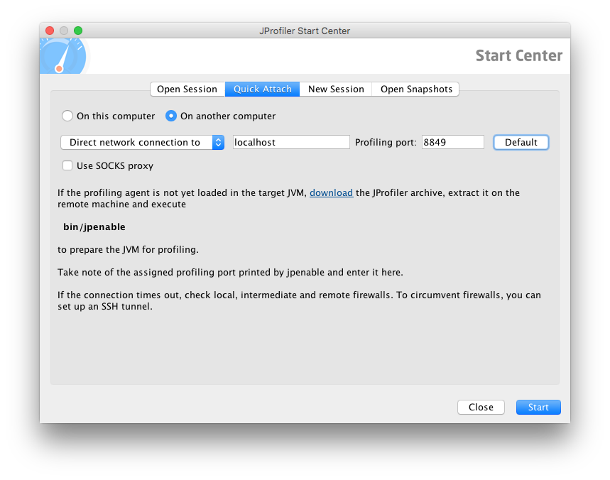

# `docker.io/paketobuildpacks/jprofiler`
The Paketo Buildpack for JProfiler is a Cloud Native Buildpack that contributes the JProfiler agent and configures it to connect to the service.

## Behavior
This buildpack will participate if all the following conditions are met

* `$BP_JPROFILER_ENABLED` is set

The buildpack will do the following:

* Contribute debug configuration to `$JAVA_TOOL_OPTIONS`

## Configuration
| Environment Variable | Description
| -------------------- | -----------
| `$BP_JPROFILER_ENABLED` | Whether to contribute JProfiler support
| `$BPL_JPROFILER_ENABLED` | Whether to enable JProfiler support
| `$BPL_JPROFILER_PORT` | What port the JProfiler agent will listen on. Defaults to `8849`.
| `$BPL_JPROFILER_NOWAIT` | Whether the JVM will execute before JProfiler has attached.  Defaults to `true`.

## Bindings
The buildpack optionally accepts the following bindings:

### Type: `dependency-mapping`
|Key                   | Value   | Description
|----------------------|---------|------------
|`<dependency-digest>` | `<uri>` | If needed, the buildpack will fetch the dependency with digest `<dependency-digest>` from `<uri>`

## Publishing the Port
When starting an application with debugging enabled, a port must be published.  To publish the port in Docker, use the following command:

```bash
$ docker run --publish <LOCAL_PORT>:<REMOTE_PORT> ...
```

The `REMOTE_PORT` should match the `port` configuration for the application (`8849` by default).  The `LOCAL_PORT` can be any open port on your computer, but typically matches the `REMOTE_PORT` where possible.

Once the port has been published, your JProfiler Profiler should connect to `localhost:<LOCAL_PORT>` for profiling.



## License

This buildpack is released under version 2.0 of the [Apache License][a].

[a]: http://www.apache.org/licenses/LICENSE-2.0
